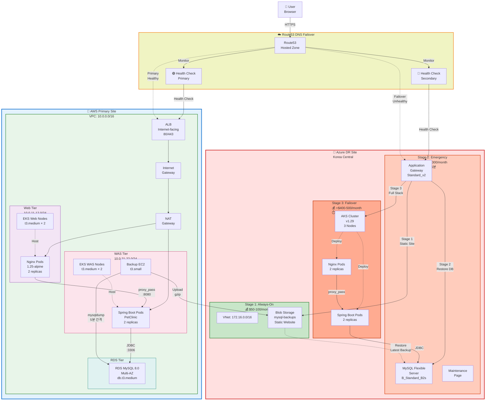
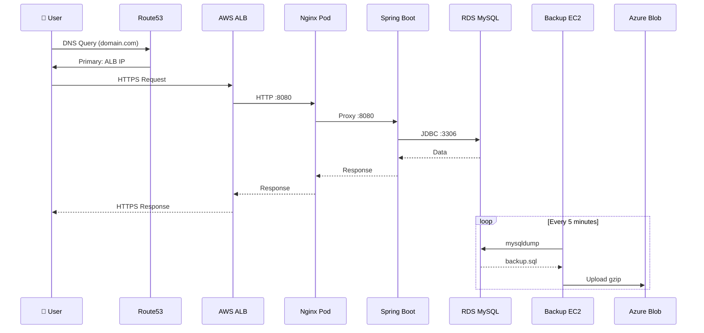
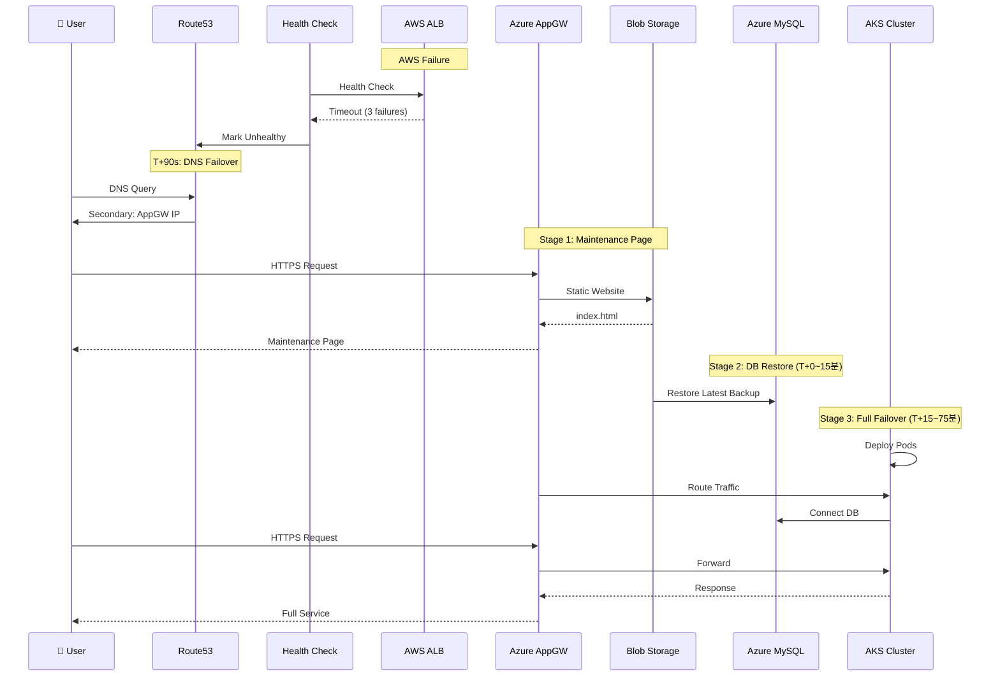
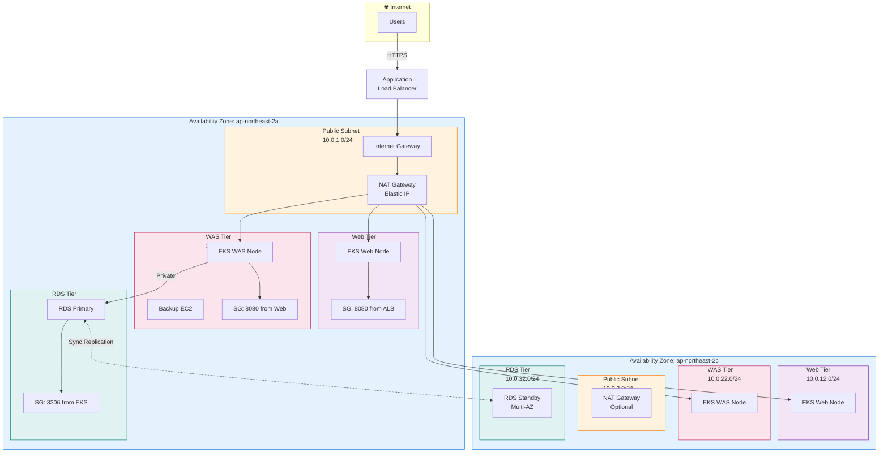
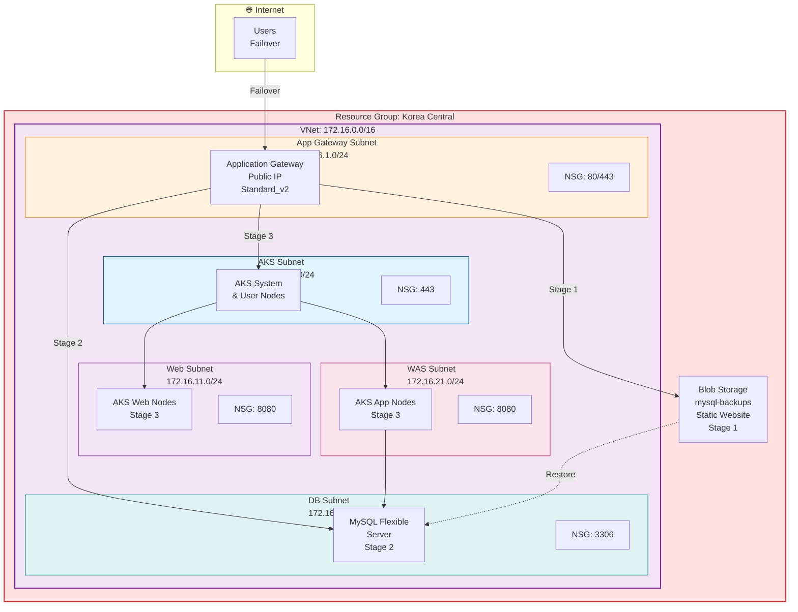
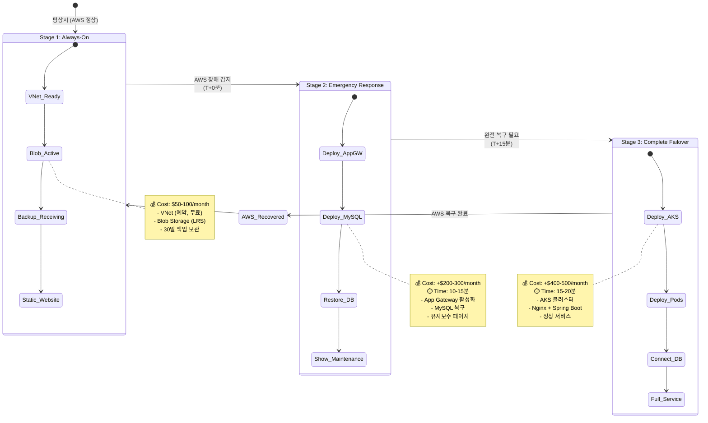

# 3-Tier Terraform Multi-Cloud DR Architecture

## 📋 프로젝트 개요

**PlanB** - 다중 클라우드 재해 복구(DR) 솔루션으로, **AWS(주)**와 **Azure(보조)**를 연동한 3계층 아키텍처입니다.
자동 DNS 페일오버를 통해 AWS 장애 시 단계별로 Azure 리소스를 활성화합니다.

- **Infrastructure as Code:** Terraform + Kubernetes
- **Primary Site:** AWS (ap-northeast-2, Seoul)
- **Secondary Site:** Azure (Korea Central, 3-stage failover)
- **Application:** Spring Boot PetClinic + Nginx
- **Database:** MySQL 8.0 Multi-AZ

---

## 🏗️ 전체 시스템 아키텍처



---

## 🔄 데이터 흐름 (Data Flow)

### **정상 운영 시 (AWS)**



### **페일오버 시나리오 (AWS → Azure)**



---

## 📊 AWS VPC 네트워크 아키텍처



---

## 🔵 Azure VNet 네트워크 아키텍처



---

## 🚀 Azure 3단계 페일오버 전략



---

## 🛠️ Terraform 모듈 구조

### **AWS 구성**

**주요 파일:**
- `main.tf` - VPC, EKS, RDS 모듈 호출
- `route53.tf` - DNS Failover 설정
- `backup-instance.tf` - 백업 자동화 EC2

**모듈 구조:**
- `modules/vpc/` - 네트워크 인프라 (VPC, Subnets, IGW, NAT)
- `modules/eks/` - Kubernetes 클러스터 (v1.34, 2 Node Groups)
- `modules/rds/` - MySQL 데이터베이스 (Multi-AZ, db.t3.medium)
- `modules/alb/` - 로드밸런서 (Internet-facing, 80/443)

**EKS 구성:**
- Web Tier Node Group: t3.medium × 2-4 (Auto-scaling)
- WAS Tier Node Group: t3.medium × 2-4 (Auto-scaling)
- Add-ons: vpc-cni, kube-proxy, coredns

**RDS 구성:**
- Engine: MySQL 8.0
- Instance: db.t3.medium
- Storage: 20GB gp3 (Auto-scale to 100GB)
- Multi-AZ: Enabled (Primary + Standby)
- Backup: 7-day retention
- Encryption: AES-256

### **Azure 구성**

**1-always/ (Stage 1):**
- `main.tf` - Resource Group, VNet, Subnets
- `storage.tf` - Blob Storage, Lifecycle policy
- `static-website.tf` - Maintenance page

**2-emergency/ (Stage 2):**
- `mysql.tf` - MySQL Flexible Server (B_Standard_B2s)
- `appgw.tf` - Application Gateway (Standard_v2)

**3-failover/ (Stage 3):**
- `aks.tf` - AKS Cluster (v1.29, 3 nodes)

---

## 📈 Kubernetes 배포 구조

### **네임스페이스**
- `web` - Nginx 웹 서버
- `was` - Spring Boot 애플리케이션

### **Web Tier (Nginx)**

**Deployment:**
- Image: `nginx:1.25-alpine`
- Replicas: 2
- Resources: CPU 200m-400m, Memory 256Mi-512Mi
- Port: 8080

**Service:**
- Type: LoadBalancer (via ALB Ingress)
- Port: 80 → 8080

**Probes:**
- Liveness: `/health` (10s)
- Readiness: `/health` (5s)
- Startup: `/health` (3s)

### **WAS Tier (Spring Boot)**

**Deployment:**
- Image: `springio/petclinic:latest`
- Replicas: 2
- Resources: CPU 1-2, Memory 1Gi-2Gi
- Port: 8080

**Service:**
- Type: ClusterIP (internal)
- Port: 8080 → 8080

**Environment:**
- `SPRING_DATASOURCE_URL` (from Secret)
- `SPRING_DATASOURCE_USERNAME` (from Secret)
- `SPRING_DATASOURCE_PASSWORD` (from Secret)
- `SPRING_PROFILES_ACTIVE=mysql`

**Probes:**
- Startup: `/actuator/health` (30 attempts × 3s)
- Liveness: `/actuator/health` (10s)
- Readiness: `/actuator/health` (5s)

---

## 🔐 보안 아키텍처

### **네트워크 보안**

**AWS Security Groups:**
- ALB-SG: Inbound 80/443 (from Internet)
- EKS-WebSG: Inbound 8080 (from ALB)
- EKS-WASSG: Inbound 8080 (from Web)
- RDS-SG: Inbound 3306 (from EKS)
- Backup-SG: Outbound 443 (to Azure)

**Azure Network Security Groups:**
- AppGW-NSG: Inbound 80/443 (Internet)
- Web-NSG: Inbound 8080 (from App Gateway)
- WAS-NSG: Inbound 8080 (from Web)
- DB-NSG: Inbound 3306 (from WAS)
- AKS-NSG: Inbound 443 (Kubernetes API)

### **데이터 암호화**

**AWS:**
- In Transit: RDS ↔ EKS (TLS), Backup → Azure (HTTPS), ALB ↔ Internet (HTTPS/ACM)
- At Rest: RDS (AES-256/KMS), EBS (AES-256), Secrets Manager (KMS)

**Azure:**
- In Transit: MySQL ↔ AKS (TLS), App Gateway ↔ Internet (HTTPS), Blob (HTTPS)
- At Rest: MySQL (TLS), Blob (SSE), Key Vault (AES-256)

### **접근 제어**

**AWS IAM:**
- EKS Cluster Role: EKS service permissions
- Node Role: ECR, CloudWatch, EBS, RDS
- Backup Role: Secrets Manager, RDS, S3
- ALB Role: Load balancer controller (via IRSA)

**Kubernetes RBAC:**
- System: Cluster admin (kube-system)
- Users: Limited (web, was namespaces)
- Service accounts: Pod-level IAM (IRSA)

**Azure RBAC:**
- Resource Group Owner: Deployment
- AKS Operator: Cluster management
- MySQL Admin: Database access
- Storage Contributor: Blob access

---

## 🔍 모니터링 및 로깅

### **AWS CloudWatch**

**Metrics:**
- EKS: cluster_node_count, pod_cpu_utilization, pod_memory_utilization, pod_network_io
- ALB: RequestCount, TargetResponseTime, HTTPCode_Target_5XX, UnHealthyHostCount
- RDS: CPUUtilization, DatabaseConnections, DiskQueueDepth, Replication Lag, Read/WriteLatency
- EC2 Backup: StatusCheckFailed, NetworkIn/Out, CPUUtilization

**Logs:**
- EKS Control Plane: api, audit, authenticator, controllerManager, scheduler
- Application Logs: /var/log/containers/*
- RDS Logs: error, general, slowquery, audit
- VPC Flow Logs: Network traffic analysis

### **Azure Monitor**

**Metrics:**
- AKS: Node CPU/Memory, Pod Count, Network Bytes
- MySQL: CPU/Memory/Storage Percent, Active Connections, Replication Lag
- App Gateway: Current Connections, Total Requests, Failed Requests, Response Time
- Blob Storage: Used Capacity, Blob Count, Transaction

**Alerts:**
- High CPU (> 80%)
- High Memory (> 85%)
- Database Connection Errors
- Backup Failure
- App Gateway Health
- Static Website Availability

---

## 🚀 배포 순서

### **Phase 1: AWS 프로덕션 (1~2시간)**

1. **Terraform init & plan** (AWS credentials configured)
2. **VPC 생성** (5분) - VPC, Subnets, IGW, NAT
3. **EKS 클러스터 생성** (15분) - Cluster endpoint 준비
4. **EKS Node Groups 생성** (20분) - Web & WAS node groups
5. **RDS 인스턴스 생성** (15-20분) - Multi-AZ 설정, Database 초기화
6. **ALB 생성** (5분) - Target groups, listeners
7. **Route53 구성** (2분) - Health checks, Failover policy
8. **Backup EC2 생성** (5분) - IAM role, security group, User data script
9. **Kubernetes 매니페스트 배포** (10분) - Namespaces, deployments, services, ingress
10. **검증 및 테스트** (15분) - DNS failover test, Pod readiness check, Database connectivity

### **Phase 2: Azure DR 기초 (30~40분)**

1. **Stage 1: Always-On 배포** (15분) - Resource Group, VNet & Subnets, Storage Account, Blob containers, Static website
2. **백업 스크립트 테스트** (10분) - mysqldump → Azure Blob 확인
3. **Route53 Health Check 활성화** (5분) - Secondary endpoint 모니터링

### **Phase 3: Stage 2-3 준비 (옵션)**

Stage 2-3 Terraform 코드를 준비하고 긴급 시 `terraform apply` 실행:
- **Stage 2:** MySQL Flexible Server, Application Gateway
- **Stage 3:** AKS 클러스터, Kubernetes 매니페스트

---

## 🛠️ 운영 절차

### **정상 운영 시 확인사항**

**Daily:**
- AWS CloudWatch 대시보드 확인 (EKS Pod, RDS CPU/Memory < 70%, ALB 응답시간 < 200ms, Route53 Health Check: OK)
- Azure 백업 확인 (Blob Storage: 최신 backup 파일 존재)

**Weekly:**
- RDS Slow Query 로그 확인
- EKS Node 상태 확인 (CPU/Memory usage, Disk usage)
- ALB Target Health 확인
- Backup 복구 테스트 (선택)

**Monthly:**
- 비용 검토 (AWS + Azure)
- 보안 패치 적용 (EKS 버전 업그레이드, Node AMI 업데이트, Kubernetes manifests 검토)
- DR 테스트 (DNS failover 시뮬레이션, Azure Stage 2-3 deployment 테스트)
- 용량 계획 (Scaling 필요성 검토)

### **장애 대응 절차**

**AWS ALB 불응 감지 (자동):**
- **T+0s:** Health check failure 시작 (매 30초)
- **T+90s:** 3번 연속 실패 → UNHEALTHY
- **T+150s:** DNS 레코드 전환 (Route53) → Secondary record (Azure App Gateway)
- **T+210s:** 사용자 요청 → Azure로 리다이렉트

**사용자 영향:**
- 브라우저 캐시 TTL: 60초
- 약 1-3분 후 Azure 유지보수 페이지 표시

**복구 절차:**
- AWS 장애 원인 파악 & 복구
- ALB Health check → HEALTHY
- Route53 자동 전환: Primary (AWS)로 복원
- 사용자: AWS로 자동 복귀 (DNS TTL 후)

**수동 복구 (필요시):**
- AWS 수동 확인 (EC2, RDS, EKS 상태)
- Route53 failover preference 수동 변경
- 수동 DNS 전환 또는 Route53 health check 비활성화

### **주요 모니터링 항목**

**Critical:**
- Route53 Health Check Status (Primary & Secondary)
- ALB Target Health (All targets HEALTHY)
- EKS Node Status (Ready)
- RDS Instance Status (Available)
- Database Connections (< max_connections)
- Azure Blob Backup (Latest < 5 minutes old)

**Warning:**
- Pod CPU/Memory Usage (> 80%)
- RDS CPU/Memory (> 70%)
- ALB Response Time (> 500ms)
- Database Replication Lag (Multi-AZ)
- Disk Usage (RDS auto-scaling utilized)
- Backup File Size (Growing normally)

**Info:**
- Request rate & patterns
- Error rates by endpoint
- API response time percentiles
- Database query patterns
- Cost trends (AWS + Azure)

---

## 📚 주요 파일 및 경로

```
/home/ubuntu/3tier-terraform/
├── README.md
├── docs/
│   ├── architecture.md (이 문서)
│   ├── failover.md
│   └── backup.md
├── codes/
│   ├── aws/
│   │   ├── main.tf
│   │   ├── variables.tf
│   │   ├── outputs.tf
│   │   ├── route53.tf
│   │   ├── backup-instance.tf
│   │   ├── modules/
│   │   │   ├── vpc/
│   │   │   ├── eks/
│   │   │   ├── rds/
│   │   │   └── alb/
│   │   ├── k8s-manifests/
│   │   │   ├── namespaces.yaml
│   │   │   ├── web/
│   │   │   ├── was/
│   │   │   └── ingress/
│   │   └── scripts/
│   └── azure/
│       ├── 1-always/
│       │   ├── main.tf
│       │   ├── storage.tf
│       │   └── static-website.tf
│       ├── 2-emergency/
│       │   ├── mysql.tf
│       │   └── appgw.tf
│       └── 3-failover/
│           └── aks.tf
└── .gitignore
```

---

## ✅ 체크리스트

### **배포 전 확인**

- [ ] AWS 계정 접근 가능 (ap-northeast-2 region)
- [ ] Azure 구독 접근 가능 (Korea Central region)
- [ ] Terraform v1.0+ 설치
- [ ] kubectl 설치
- [ ] AWS CLI v2 설치
- [ ] Azure CLI 설치
- [ ] Domain name 소유 (Route53 hosted zone 생성 가능)
- [ ] ACM SSL 인증서 요청 (AWS)

### **배포 후 확인**

- [ ] AWS EKS 클러스터 정상 실행
- [ ] 모든 Pod RUNNING 상태
- [ ] RDS MySQL 데이터베이스 접근 가능
- [ ] ALB가 Nginx & Spring Boot 정상 응답
- [ ] Route53 Health Check: Primary HEALTHY
- [ ] Azure Blob에 첫 백업 파일 생성
- [ ] DNS failover 테스트 성공

### **운영 준비**

- [ ] CloudWatch 대시보드 설정
- [ ] Azure Monitor 알림 설정
- [ ] 백업 복구 테스트
- [ ] DR 테스트 계획 수립
- [ ] 팀 교육 (운영 절차)
- [ ] 비상 연락처 등록
- [ ] 문서화 완료

---

**마지막 업데이트:** 2025-12-22
**작성자:** DevOps Team
**상태:** Production Ready
